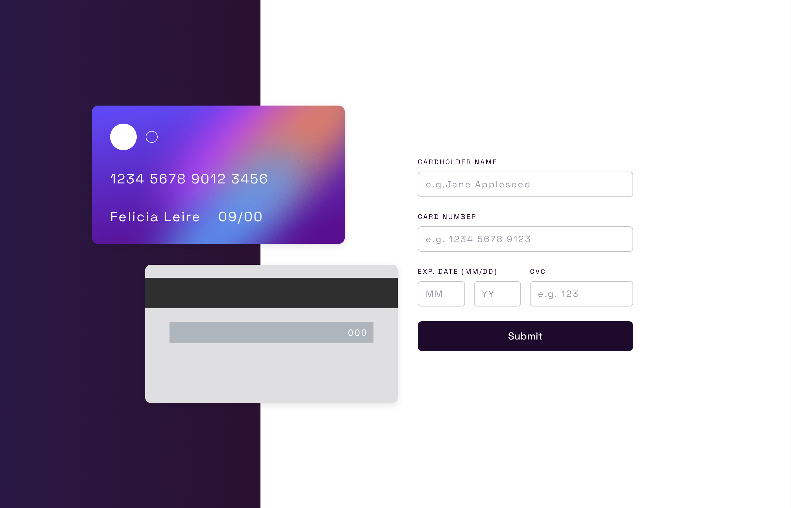

# An interactive credit card form using React and TypeScript
 

## Features
 - Interactive credit card form
 - Form validation
 - Form submission
 - Responsive design
 - Built with React and TypeScript

# Project Setup

In the project directory, you can run:

`npm start`

Runs the app in the development mode.

`npm test`

Launches the test runner in the interactive watch mode.\
See the section about [running tests](https://facebook.github.io/create-react-app/docs/running-tests) for more information.

`npm run build`

Builds the app for production to the `build` folder.\
It correctly bundles React in production mode and optimizes the build for the best performance.

